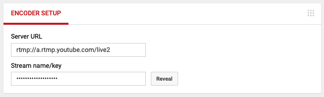

# SenbayLive
SenbayLive is a sample live streaming application using SenbayKit. You can publish a [SenbayVideo](http://www.senbay.info) via RTMP (which is a defacto standard live streaming protocol and supported on YouTube Live) on the real-time.

## Requirement
- A macOS deivce with the latest Xcode
- An iOS (iOS10 or later) device which has a camera module
- A Google Account (for YouTube Live)

## How to use
1. Downalod SenbayLive on your macOS device
```shell
git clone https://github.com/tetujin/SenbayLive/
```

2. Install required libraries via [CocoaPods](https://cocoapods.org/)
```shell
cd SenbayLive
pod install
```

3. Open SenbayLive.xcworkspace by Xcode and change `Bundle Identifier` to your unique one.

4. Build&Run the application on your iPhone

5. Open [YouTube Live](https://www.youtube.com/live_dashboard) and get "Server URL" and "Stream name/key" on Encoder Setup

<p>
    
</p>

6. Copy&Paste "Server URL" and "Stream name/key" to SenbayLive

7. Push the start button on SenbayLive. You can publish SenbayVideo via YouTube Live.

## Configuration

### Camera
`SenbayCameraConfig` allow us to change camera configurations. [The following code](https://github.com/tetujin/SenbayLive/blob/445fccdafc0d5cc26b0f6fd6147136a796ab2169/SenbayLive/ViewController.swift#L27) shows the default configuration of the SenbayCamera. You can change video size, frequency, and QRcode size at the code. Please refer to [SenbayKit](https://github.com/tetujin/SenbayKit) about the options.

```swift
let CONFIG = SenbayCameraConfig.init { (config) in
    config.maxFPS = 30
    config.videoSize = AVCaptureSession.Preset.hd1280x720
    config.isExportSenbayVideo = false
    config.isExportOriginalVideo = false
    config.qrcodeSize = Int32(1280 * 0.15);
}
```

### Sensors
`SenbaySensorManager` handling sensor data in `SenbayCamera` instance. [By the default](https://github.com/tetujin/SenbayLive/blob/445fccdafc0d5cc26b0f6fd6147136a796ab2169/SenbayLive/ViewController.swift#L38), accelerometer and location sensor are activated. Please refer to [SenbayKit](https://github.com/tetujin/SenbayKit) about the options.

```swift
let camera = SenbayCamera.init(previewView: IMAGE_VIEW, config: CONFIG)
if let manager = camera?.sensorManager {
    manager.imu.activateAccelerometer()
    manager.location.activateGPS()
}
```

## Author and Contributors

SenbayKit is authord by [Yuuki Nishiyama](http://www.yuukinishiyama.com). In addition, [Takuro Yonezawa](https://www.ht.sfc.keio.ac.jp/~takuro/), [Denzil Ferreira](http://www.oulu.fi/university/researcher/denzil-ferreira), [Anind K. Dey](http://www.cs.cmu.edu/~anind/), [Jin Nakazawa](https://keio.pure.elsevier.com/ja/persons/jin-nakazawa) are deeply contributing this project. Please see more detail information on our [website](http://www.senbay.info).

## Related Links
* [Senbay Platform Offical Website](http://www.senbay.info)
* [Senbay YouTube Channel](https://www.youtube.com/channel/UCbnQUEc3KpE1M9auxwMh2dA/videos)

## Citation
Please cite these papers in your publications if it helps your research:

```
@inproceedings{Nishiyama:2018:SPI:3236112.3236154,
    author = {Nishiyama, Yuuki and Dey, Anind K. and Ferreira, Denzil and Yonezawa, Takuro and Nakazawa, Jin},
    title = {Senbay: A Platform for Instantly Capturing, Integrating, and Restreaming of Synchronized Multiple Sensor-data Stream},
    booktitle = {Proceedings of the 20th International Conference on Human-Computer Interaction with Mobile Devices and Services Adjunct},
    series = {MobileHCI '18},
    year = {2018},
    location = {Barcelona, Spain},
    publisher = {ACM},
} 
```

## License

SenbayKit is available under the Apache License, Version 2.0 license. See the LICENSE file for more info.
